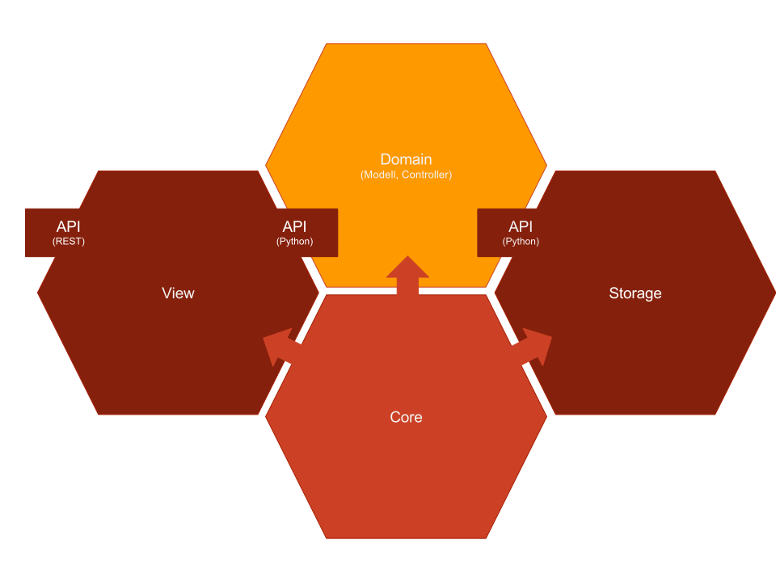
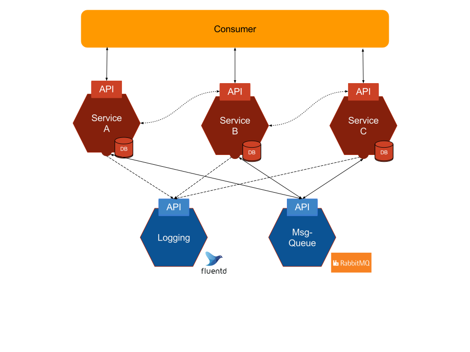
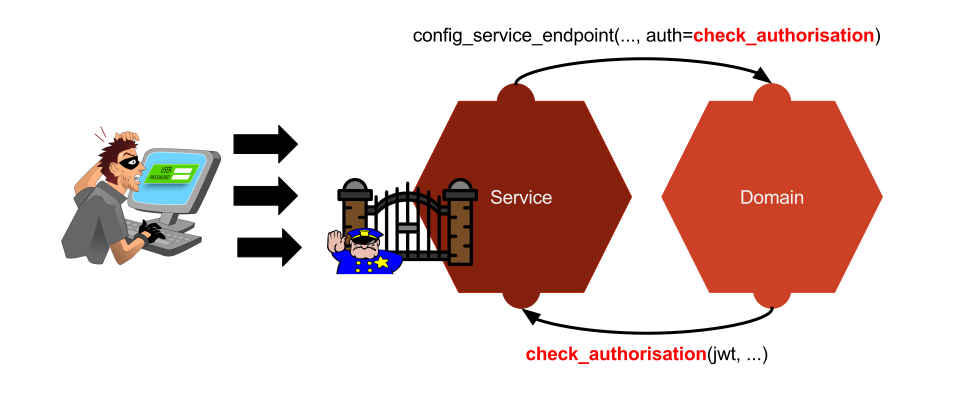

.. _architecture:

Architektur
===========
Dieser Abschnitt gibt einen allgemeinen Überblick über den Aufbau und die
Architektur von Tedega. Dabei wird beschrieben, wie mit Hilfe der verschiedenen
Komponenten eine Anwendung bestehend aus verschiedenen Microservices erstellt
und betrieben werden können.

Detailierte Informationen finden sich in der Dokumentation der jeweiligen
Komponente.

Über die Modellierung von Microservices gibt es viel Literatur. Auf die
Quellen, die den Aufbau von Tediga maßgeblich beeinflusst haben möchte ich
gerne verweisen:
Viele Ideen und Ansätze zum Aufbau von Microservices stammen das dem Buch
"Building Microservices" von Sam Newmann [Newmann2015]_. Weiter sind einige
Ideen (Insbesonderer zur :ref:`deployment`) durch das Buch "The DevOps Handbook"
[DOP2016]_ inspiriert. Hilfreich bei der Modellierung von gut abgegrenzen
Diensten war "Implementing Domain-Driven Design" [Ver2013]_.

Zunächst wird der Aufbau eines einzelnen :ref:`view` beschrieben. Dann wird
beleuchtet wie Microservices innerhalb der :ref:`anwendung` interagieren.
Neben dem grundsätzlichen Aufbau werden auch die :ref:`security` betrachtet
und :ref:`design` beschrieben, die bei der Entwicklung von Tediga berücksicht
wurden.

.. _microservice:

Microservice
------------
Ein Microservice ist in einem Schichtmodell ähnlich des MVC Modell
organisiert. Allerdings wird das Schichtmodell um eine weitere Schicht
erweitert, die speziell die Speicherung der Daten behandelt. Tedega nutzt für
die Implementation eines Microservices somit ein MVCS Schichtmodell (Model, View,
Controller, Store).
Jede der Schichten ist als eigenständige Komponente (Bibliothek)
implementiert, die die Aufgaben der jeweiligen Schicht übernimmt.

Ziel dieser Architektur ist eine möglichst klare Abgrenzung und Trennung von
Verantwortlichkeiten zwischen den Schichten. Diese Trennung wird durch die
Implementation in unterschiedlichen Bibliotheken unterstrichen. Damit folgt
die Architektur grundsätzlich der Idee des Single Responsibility Prinzip
(SRP). Weiter ergibt sich die eine loose Kopplung zwischen den Schichten und
dadurch die Flexibilität Microservices in unterschiedlichen Versionen einer
Komponente zu betreiben, was das Risiko bei Updates minimiert.

Als Ergebnis erhalten wir Komponenten, die über mehrere Microservices
wiederverwendet werden können, und vermeiden so die Duplizierung von Code
(DRY). Dadurch kann man sich bei der Implementation eines Microservice voll
auf den Kern konzentrieren: Der Implementation der Geschäftslogik innerhalb
der `Domain`.

.. index::
   pair: Schichtmodell; MVC
   pair: Schichtmodell; MVCS

Das Herzstück eines Microservice ist die :ref:`domain` Komponente. Sie ist der
individuelle Teil eines Microservice und bestimmt wie ein Microservice
funktioniert. Sie implementiert das Datenmodell (Modell) und alle Details der
Geschäftslogik (Controller). Details zur Speicherung oder die Behandlung von
Requests werden nicht behandelt, sondern werden an jeweils anderen Komponente
delegiert.

Die :ref:`view` Komponente dient als Einstieg in den Microservice und
behandelt sämtliche Aspekte der Behandlung von HTTP Anfragen. Sie macht die
durch die `Domain` definierter Controller über eine REST-API öffentlich verfügbar.
Sämtliche Zugriffe erfolgen ausschließlich über die durch die View
definierten REST-API.

Die :ref:`storage` Komponente abstrahiert die Speicherung (Store) von Daten
und erlaubt der `Domain` die Daten aus dem Model zu speichern.

Die :ref:`core` Komponente stellt allgemeine Funktionalität für die übrigen
Komponenten zur Verfügung.

.. index::
   pair: Design Prinzipien; Single Responsibility Prinzip (SRP)
.. _anwendung:

Anwendung
---------
Eine Anwendung setzt sich in seiner Gesamtfunktion aus verschiedenen
Microservices zusammen. Jeder Microservice übernimmt einen klar abgrenzte
Teilfunktion.

.. index::
   single: Domain Driven Design (DDD)

In einer Anwendung für ein Versandhaus könnte ein Service die
Kundendaten verwalten, und anderer den Lagerbestand, das
Abrechnungssystem oder den Warenkorb. Die Abgrenzung von den einzelnen Services
ist eine nicht triviale Aufgabe und Bedarf viel Erfahrung, Überlegungen und
Klärung im Vorfeld. Sehr hilfreich bei dem Ermitteln von diesen Grenzen sind
Methoden aus dem `Domain Driven Desigen (DDD)` die unter anderem auch in
[Ver2013]_ beschrieben sind.

In der Grafik sind drei Services zu sehen. Jeder Service ist weitgehend
unabhängig von anderen Services. Ein Service speichert seine Daten in seiner
eigenen Datenbank und enthält sämtliche Geschäftslogik. Jeder der Services
bietet über eine REST-API seine Dienste an.

.. index::
   double: Service; Inter Service Kommunikation
   double: Inter Service Kommunikation; Rabbit-MQ

Inter Service Kommunikation
^^^^^^^^^^^^^^^^^^^^^^^^^^^
Wir haben gesehen, dass jeder Service möglichst unabhängig von anderen Diensten
sein soll. Dadurch ergibt sich in einer verteilten Anwendung naturgemäß sehr
schnell der Bedarf, dass Informationen zwischen den Services ausgetauscht werden
müssen.

Der wahrscheinlich häufigste Grund für den Austausch von Daten ist, dass ein
Service die notwendigen Daten, die er zur Bearbeitung einer Anfrage benötigt,
nicht vollständig selber speichert und diese von einem anderen Dienst
abgefragt werden müssen.
Ein anderer Grund kann sein dass andere Dienste in Folge einer Änderung an
den Daten benachrichtigt werden müssen, damit diese eigene Aktionen ausführen.

Inter Service Kommunikation bezeichnet den Austausch von Daten zwischen den
einzelnen Microservices innerhalb der Anwendung. Das können Benachrichtigungen
über Ereignisse sein, oder das Laden von weiteren Informationen und Daten aus
anderen Quellen.

.. note::
        Eine weitere häufig anzufindene und vielleicht naheliegende
        Möglichkeit zur Umsetzung dieser Kommunikation ist ein zentraler
        Service, der die Koordination zwischen den verschiedenen Services
        übernimmt.

        Allderdings verletzt diese zentrale Instanz gleich in mehreren Punkten
        das Prinzip der loosen Kooplung und hohen Zusammenhalt: Erstens wird
        durch eine zentrale koordinierende Instanz eine starke Kopplung
        zwischen den Services eingeführt. Zweitens wird zusammenhängende Logik
        über mehrere Services verteilt. Daher wird dieser Ansatz in Tediga
        nicht weiter berücksichtigt.

Tediga sieht für die Kommunikation zwei verschiedene Arten vor:

1. Direkte Kommunikation zwischen den Microservices. Diese findet
   ausschließlich per HTTP über die jeweilige öffentliche REST-API der Services
   statt. Ein Service agiert dabei wie ein gewöhnlicher Client.
2. Indirekte Kommunikation über eine Message-Queue. Diese wird verwendet, um
   anderen Services zu benachrichtigen. Dabei schreibt ein Service alle Dinge,
   über die er andere Services informieren möchte in die Queue. Die anderen
   Dienste lesen diese Nachrichten und entscheiden selbständig, ob Sie selber
   tätig werden müssen.  Ein Beispiel: Der Nutzer-Service des Versandhaus
   löscht einen Nutzer und schreibt diese Aktion in die Message Queue. Der
   Warenkorb liest diese Nachricht und löscht daraufhin hin den zu dem Nutzer
   gehörenden Warenkorb.

Als Message-Queue wird die Software `RabbitMQ <https://www.rabbitmq.com/>`_
verwendet.

.. index::
   double: Service; Logging
   double: Logging; Fluentd

Logging
^^^^^^^
Um den Betrieb der Anwendung zu überwachen benötigen wir einen Mechanismus zum
Protokollieren von verschiedenen Metriken unserer Dienste. Diese Informationen
helfen uns zu beurteilen ob unsere Anwendung gut funktioniert. Sie ermöglichen
uns frühzeitig Engpässe zu erkennen, zu sehen dass ein Dienst ausgefallen ist,
oder ob Fehler auftreten, und in welcher Form die Anwendung genutzt wird.

In einer monolithischen Anwendung liegen all diese Informationen auf einem
System vor. Das macht die Analyse der Informationen überschaubar. In einer
verteilten Anwendung ist das aber ungleich schwieriger. Hier entstehen diese
Informationen auf vielen unterschiedlichen Systemen, und steht vor der
Herausforderung diese Informationen in ihrer Gesamtheit auszuwerten, um
Rückschlüsse über die Anwendung zu erhalten.

Ich halte das Protokollieren von verschiedenen Metriken als ein Element von
zentraler Bedeutung für einen reibungslosen Betrieb. Aus diesem Grund sieht
Tediga einen Mechanismus für die Protokollierung vor, der die Informationen
zentral in einer einheitlichen Form erfasst und verschiedenen Werkzeugen zur
Analyse und Auswertung zur Verfügung stellt.

Tediga nutzt für die die zentrale Erfassung von Logs `Fluentd
<https://www.fluentd.org/>`_. Dieser sammelt alle zu Logs in einer
einheitlichen Form ein, und speichert diese nach Bedarf in verschieden
Backends. Von dort können die Logs Sie dann mit Werkzeugen wie *Elasticsearch*
oder *Hadop* analysiert werden.
Tediga stellt den Anwendungen Funktionen zum Protokollieren zur Verfügung, um
sicher zu stellen, dass die Daten in einer einheitlichen Form geloggt werden,
was eine Voraussetzung für spätere Auswertungen ist.

Was wird geloggt?
"""""""""""""""""

Um eine Anwendung zu überwachen, sieht Tediga folgende Kategorien vor:

* **Erreichbarkeit**. In regelmäßigen Abständen wird für jeden Dienst geprüft,
  ob dieser prinzipiell erreichbar ist, oder ob z.B. ein Fehler im Netzwerk
  vorliegt. Meldungen zur Erreichbarkeit haben die Kategorie *PING*.
* **Auslastung RAM, CPU, Speicherplatz**. Wir holen in regelmäßigen Abständen
  Informationen zur Auslastung von Arbeitsspeicher, Last und
  Speicherplatz ab, um frühzeitig Flaschenhälse erkennen zu können. Die
  entsprechenden Kategorien lauten *CPU*, *RAM* und *DISK*.
* **Bearbeitungszeit**. Bei jeder Anfrage an einen Dienst wird die Antwortzeit
  im Millisekunden protokolliert, die ein Dienst benötigt um die Anfrage zu
  beantworten. Die Zeit summiert alle notwendigen Schritte auf die für die
  Beantwortung durchgeführt werden. So auch eventuelle Abfragen zu anderen
  Diensten. Die Kategorie für die Bearbeitungszeit lautet *PROCTIME*
* **Status Antwort**. Jede Anfrage protokolliert den HTTP Status seiner
  Antwort. Die Kategorie für den Status lautet *RETURNCODE*
* **Fehler und Warnungen**. Im Falle von Fehler und Warnungen werden diese
  ebenfalls protokolliert. Dies können sowohl definierte Fehlermeldungen sein,
  als auch Tracebacks der Anwendung. Meldungen werden mit der Kategorie
  *ERROR* bzw. *WARNING* kategorisiert.
* **Anfragen**. Sämtliche Anfragen an die Anwendung werden protokolliert. Das
  Umfasst die Url, Methode (GET, POST, PUT...) und mögliche Parameter. Sie
  werden in der Kategorie *REQUEST* markiert.
* **Authentifizierung und Autorisierung**. Wir speichern zu jeder Anfrage
  Informationen zur Authentifizierung, bzw. Autorisierung in der
  Kategorie *AUTH*
* **Weitere Angaben**. Neben den oben beschriebenen Angaben können natürlich
  auch beliebige weitere Angaben nach Bedarf protokolliert werden. Diese
  sollten dann mit *CUSTOM* kategorisiert werden.

Formatierung
""""""""""""
Damit die Meldungen in einer zentralen Stelle systematisch ausgewertet werden
können, müssen alle Meldungen in einem vorgegebenen Format vorliegen::

        TIME.HOST.CONTAINER.SERVICE.CATEGORY[.CORRELATION_ID] [LEVEL]: Message to be logged.

============== ============
Abschnitt      Beschreibung
============== ============
TIME           Zeit im Format YYYY-mm-dd HH:MM
HOST           Name des Rechners.
CONTAINER      Name Containers.
SERVICE        Name des Service
CATEGORY       Art der Logmeldung. Siehe `Was wird geloggt?`
CORRELATION_ID Wenn eine Anfrage zum ersten Mal auf einen Service trifft, wird eine eindeutige UUID generiert, die in allen weiteren Abfragen verwendet wird, um zusammengehörende Meldungen über verschiedene Services hinweg verfolgen zu können. Die Angabe ist optional, da nicht alle Meldungen in Services generiert werden, oder eine solche UUID benötigen.
LEVEL          Gibt an ob es sich bei der Meldung um einen Fehler (ERROR), eine Warnung (WARNING), eine Information (INFO) oder Debug-Ausgabe ist (DEBUG). Die Vorgabe für eine Meldung ist INFO.
============== ============

.. index::
   single: Jason Web Token (JWT)
.. _security:

Sicherheit
----------
Die folgenden Betrachtungen beschränken sich auf die Frage wie ein einzelner
Microservice gegen nicht autorisierte Zugriffe geschützt werden kann.

Tediga verwendet zur Autorisierung ein `Jason Web Token <https://jwt.io/>`_ welches im
Header einer Anfrage enthalten sein muss::

    Authorization: Bearer <token>

Ohne gültiges JWT wird eine Anfrage
nur dann autorisiert, wenn der Service für die entsprechende Anfrage keine
Autorisierung erfordert.

Die Autorisierung von Anfragen wird an zentraler Stelle durch die
:ref:`view` Komponente durchgeführt. Die Überprüfung findet für jede
Anfrage einmalig beim Eingang in die View statt.  Die Überprüfung der
Autorisierung wird in zwei Schritten und an zwei Stellen durchgeführt:

1. Zunächst überprüft die View ganz grundlegende Dinge wie das Format, die
   Integrität des Tokens, oder ob dieses noch gültig ist. Sobald eine dieser
   ersten Überprüfungen fehlschlägt, wird die Anfrage abgewiesen.

2. Danach findet eine spezifische Autorisierung statt. Sie findet im Kontext
   der jeweiligen Domain und Funktion statt. Hierfür definiert die
   :ref:`domain` eine spezielle Funktion, die alle Details der Autorisierung
   implemetiert. Diese Funktion wird bei der Registrierung der jeweiligen
   Methoden der Controller mit der Funktion *config_service_endpoint* als Parameter
   übergeben. Im Bild ist das die Funktion *check_authorisation*. Sie nimmt
   als Parameter das JWT entgegen auf dessen Basis die Überprüfung
   durchgeführt werden kann.

Nur wenn beide Überprüfungen erfolgreich sind, wird die Anfrage weiter
bearbeitet. Eine erfolgreich überprüfte Anfrage wird nicht erneut überprüft.
Alle weiteren Zugriff innerhalb des Service gelten als implizit autorisiert.

Unterabfragen an einen einen anderen Service, müssen erneut autorisiert
werden. Hierzu sendet der Service bei der Anfrage das JWT zur Autorisierung
einfach weiter.

.. .. _jwt:
..
.. Aufbau JWT
.. ^^^^^^^^^^
.. TODO

.. _design:

Design Prinzipien
-----------------
Tedega wurde vor dem Hintergrund der folgenden Prinzipien im Design umgesetzt.
Diese Prinzipien finden sich sowohl in einem einzelnen Microservice, als auch in
der Anwendung im Gesamten.

.. index::
   pair: API; Open Api Specification
   pair: API; Swagger
   triple: Design Prinzipien; Api First; API

1. **API first.**  Die API ist das wichtigste User Interface und die
   zentralen Schnittstelle für Konsumenten, und Entwickler unserer Dienste.
   Eine sauber definierte API ist die Voraussetzung für alle folgenden Prinzipien.
   Aus diesem Grund hat die Definition einer API eine hohe Bedeutung. Tedega
   verwendet zur Dokumentation der öffentliche API die `Open API Spezifikation
   <https://www.openapis.org/>`_ und `Swagger <https://swagger.io>`_

.. index::
   pair: Design Prinzipien; KISS (Keep it simple and stupid)

2. **KISS.** Keep it simple and stupid. Wir wollen Dinge so einfach wie
   möglich halten und nicht unnötig verkomplizieren. Die Funktion einer
   Komponente oder eines Service soll für ein breites Publikum einfach zu
   verstehen und anwendbar sein. Hierfür bevorzugen wir etablierte und weit
   verbreitete Technologien und Konzepte, um das Verständnis durch die
   verfügbare Dokumentation und Informationen zu vereinfachen.

.. index::
   pair: Design Prinzipien; Loos Coupling, High cohesion

3. **Loose Kopplung und hoher Zusammenhalt.** Tedega versucht zusammenhängende
   und gleichartige Funktionalität in Komponenten zu organisieren und diese
   Komponenten möglichst voneinander zu entkoppeln indem Abhängigkeiten
   vermieden werden (`Single Responsibility Pronzip (SRP)
   <https://de.wikipedia.org/wiki/Single-Responsibility-Prinzip>`_). Das
   fördert das Verständnis der Funktion und vermeidet unerwünschte
   Seiteneffekte bei Änderungen einer Komponente.

.. index::
   pair: Design Prinzipien; DRY (Don't repeat yourself)

4. **DRY.** `Don't Repeat yourself
   <https://de.wikipedia.org/wiki/Don%E2%80%99t_repeat_yourself>`_. Tedega
   setzt bei der Implementation eines Service soweit möglich auf
   wiederverwendbare Komponenten und gemeinsam genutzte Bibliotheken. Das
   vermeidet Redundanzen durch Code-Duplizierung und reduziert so den Aufwand
   für die Wartung. DRY darf und wird verletzt werden, wenn sich der Code
   dadurch zu sehr verkompliziert und damit das höher eingestufte KISS Prinzip
   verletzen würde. Die potenziell entstehende Kopplung der Bibliotheken wird
   dabei bewusst in Kauf genommen, da der erwartete Vorteil bei der Wartung
   die Nachteile einer Kopplung überwiegen [#]_.

.. [#] Das gilt besonders vor dem Hintergrund des frühen Entwicklungsstadiums
       von Tedega und dem Umstand das die Entwicklung derzeit eine
       One-Man-Show ist.

Beispiel
--------
Im folgenden Beispiel wird ein einfacher Microservice implementiert. Dieser
Service stellt unter dem Pfad */pings* eine einzige Methode zur Verfügung, die
ohne weitere Parameter per einfache GET Anfrage aufgerufen werden kann.

Das `Beispiel auf Github <https://github.com/tedega/examples>`_ lässt sich wie
folgt ausprobieren. Der Service lässt sich dann auf
`http://localhost:5000/ui <http://localhost:5000/ui>`_ ausprobieren::

    git clone https://github.com/tedega/examples
    cd examples
    python setup.py develop
    python tedega_examples/app.py

Jeder Aufruf dieser Adresse wird mit der aktuellen Zeit in eine Tabelle in der
Datenbank geschrieben. Der Server beantwortet jede Anfrage mit einer
JSON-Datenstruktur, die das Datum der Ersten und Letzten Anfrage enthält,
sowie die Anzahl aller bisherigen Anfragen und einen feste Zeichenkette.

.. important::
    Ein Microservice muss immer als Python Paket implementiert werden. Der
    hier beschriebene Code ist also nur ein Teil eines solchen Pakets.
    Informationen darüber was mindestens in einem solchen Paket enthalten sein
    muss finden sich im `Python Packaging Tutorial
    <http://python-packaging.readthedocs.io/en/latest/minimal.html>`_.
    Weiterführende Informationen zur Paketierung finden sich im `Python
    Packaging User Guide
    <https://packaging.python.org/tutorials/distributing-packages/#packaging-your-project>`_

Dieses Beispiel beinhaltet alle wichtigen Funktionen aus den verschiedenen
Komponenten, die benötigt werden um einen Microservice zu bauen.

API
^^^
.. literalinclude:: examples/minimal/swagger.yaml
   :language: yaml

Service
^^^^^^^
.. literalinclude:: examples/minimal/app.py
   :language: python
